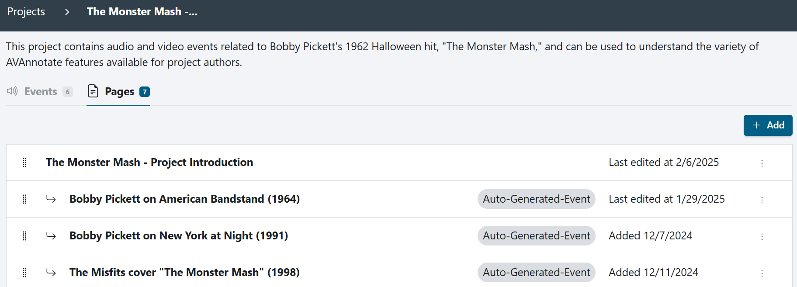

# Creating and Disabling Auto-generated Pages 
Auto-generated pages are selected on the [Add a Project](https://avannotate.github.io/documentation/pages/creating_projects/) page and the [Add an Event](https://avannotate.github.io/documentation/pages/events/) page. When auto-generated pages are selected in `Event,` AVAnnotate will generate a home page with a table of contents. If an 'Event' has an auto-generated page, the published event page will include a media player, annotations, and a description. Auto-generated pages appear in the generated Table of Contents and navigation menu. 

## When adding an Event, "auto-generate web page" is toggled on by default, but can be disabled at any point in the Event settings.

**Image 1: Authors can toggle "auto-generate web page" on/off on "Add Event" page**
 
 
 

## On the dashboard for a project, auto-generated pages are marked as “Auto-Generated - Home” (to indicate the project home page) or “Auto-Generated - Event” (to indicate an event page). 

**Image 2: Home and Event auto-generated pages in the dashboard.**
 
 
 

## Disable auto-generated home and event pages by selecting the three-dot menu and clicking "Disable Auto-Generation." This will generate an empty page for creating a [custom page](https://avannotate.github.io/documentation/pages/custom/). 
 
**Image 3: A project with auto-generated events pages and a custom project home page, which is not tagged as “Auto-Generated Home” because the project’s author disabled auto-generation in order to customize the home page.**
 
 
 

## Auto-generated Event pages by default feature a media player alongside space for the project author’s user-generated annotations.  

**Image 4: Front-end view of an auto-generated video event page. The most basic auto-generated event page contains 1) a title (and optional description), and 2) a media player to display the A/V event that has been uploaded to the project.** 
 
 
 

## Once the user uploads annotations for an event, they will display next to (video) or under (audio) the media player. 

**Image 5: Layout for an auto-generated Event page with imported annotations**
 
 
 

