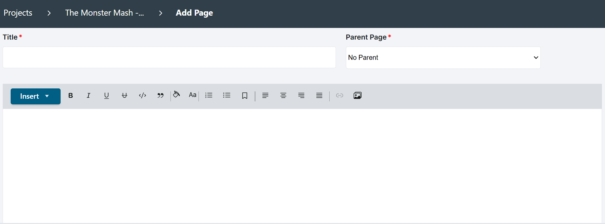

## Custom pages can be used for the home page; event pages or other pages with text; AV clips with or without associated annotations; AV event or clip comparisons; and images (via URL links).

### Home and Event pages can be customized by disabling [auto-generation](https://avannotate.github.io/documentation/pages/auto/). To disable auto-generation on a given Home or Event page, click on the three dots and select “Disable Auto-Generation.”  

**Image 1: How to disable auto-generation on the project dashboard**
 
 
 

### Custom author-generated pages may include context about events and clips, but can also comprise events and clips. Create a custom author-generated page by clicking on the “Add” button in the project dashboard. 
 
**Image 2: How to add a custom author-generated page**
 
 
 

### Once the page is added, authors can add a title and text; assign a parent page; and customize the text on the page via the rich text editor. 
 
**Image 3: Custom text editor layout options**
 
 
 

### Project authors can also customize page layout on custom pages.  

**Image 4: Insert page layout options including columns, horizontal separators, and single or comparison events (full or clips)**
 
 
 
